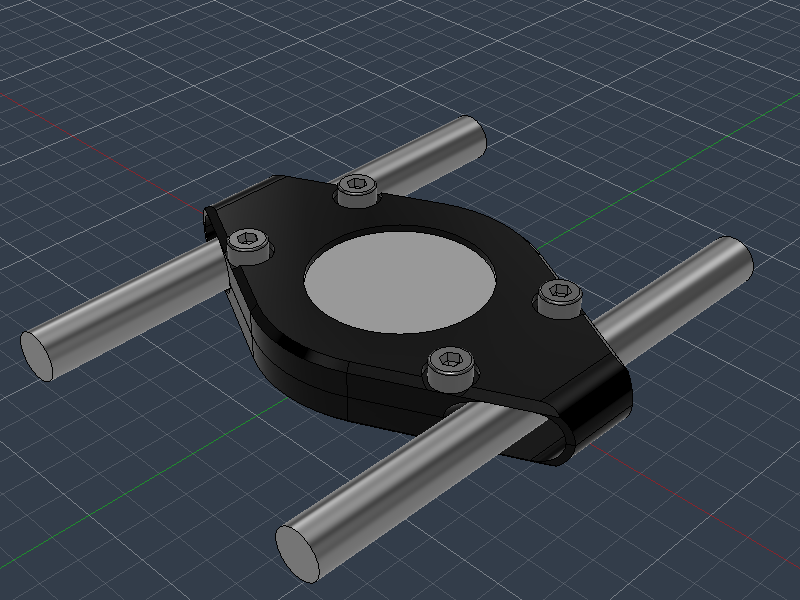
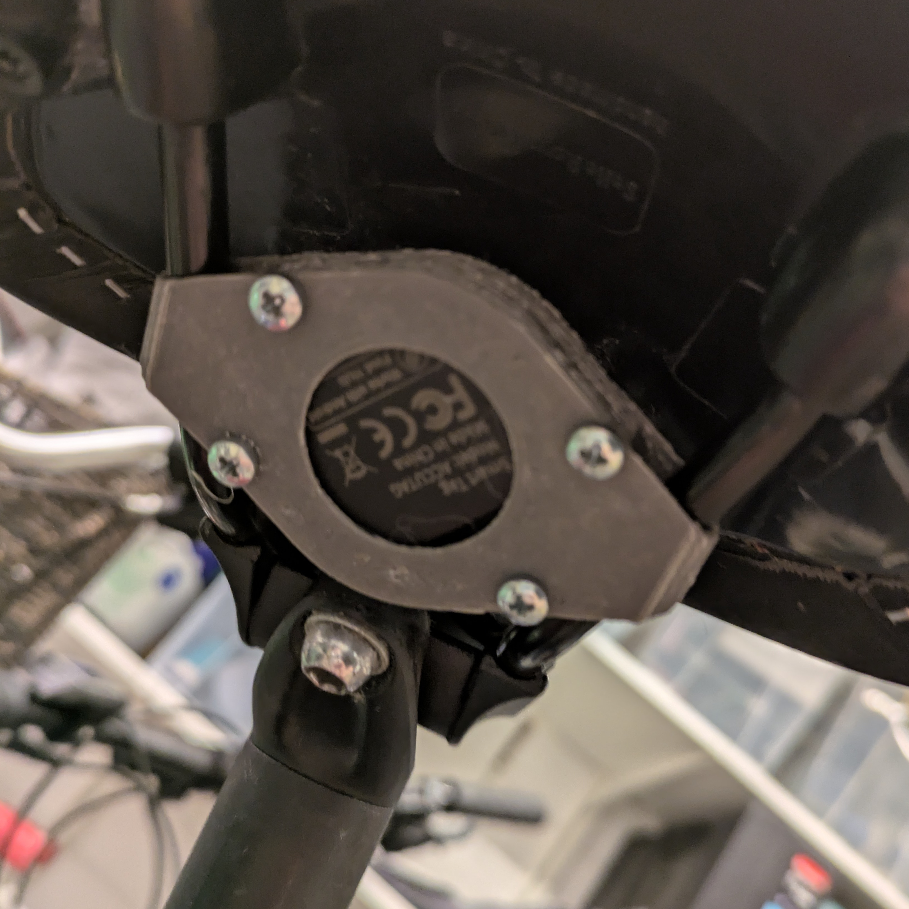
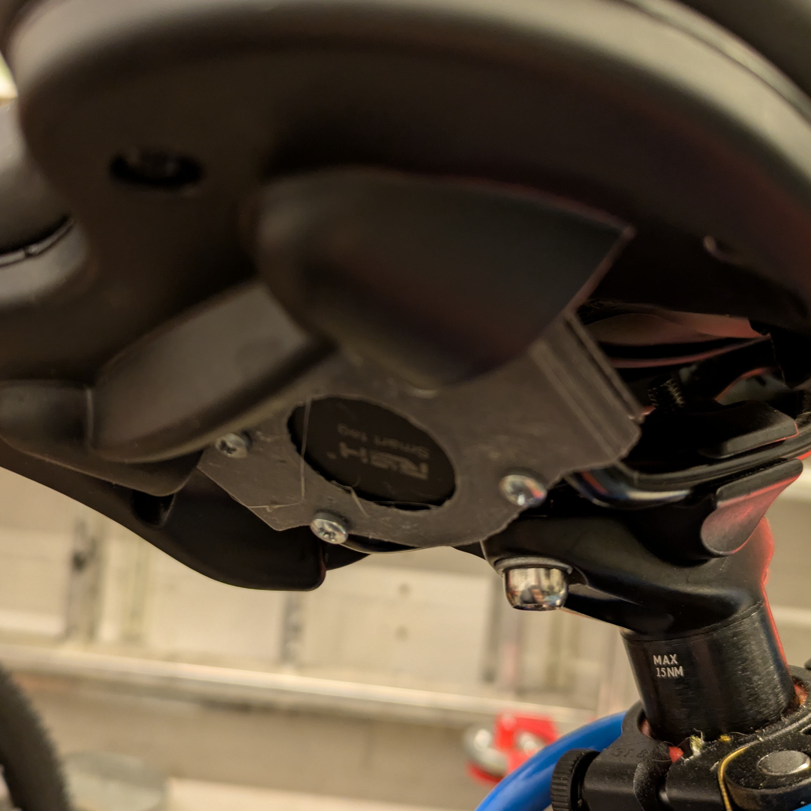
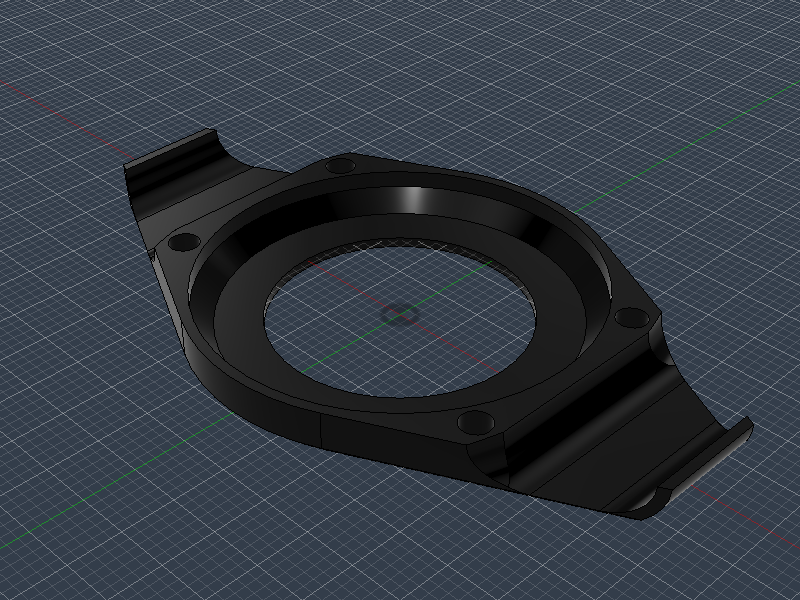
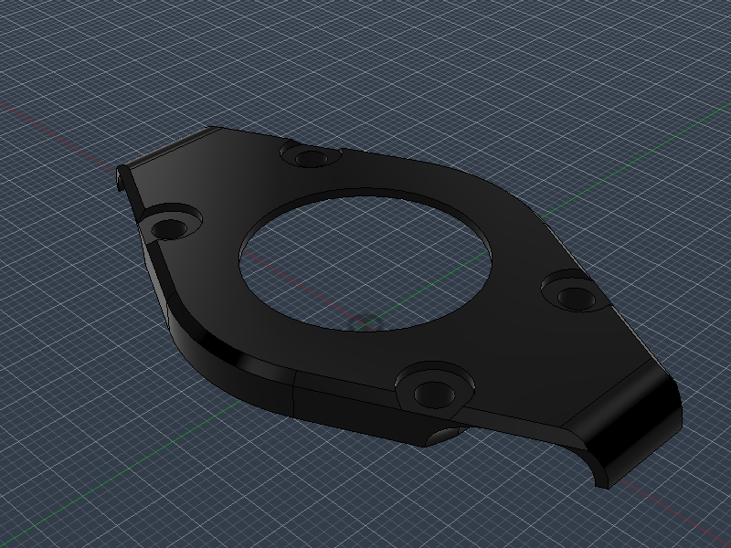
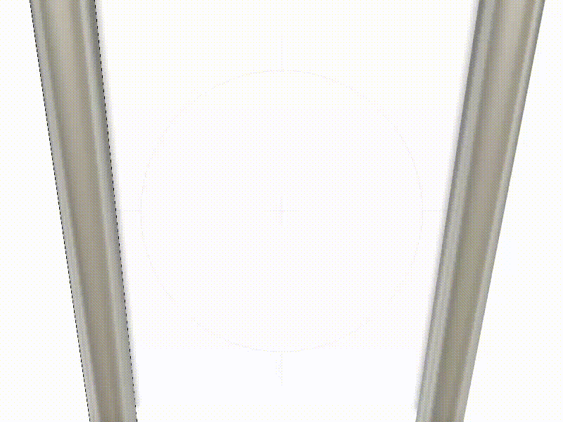

# GPS Tracker Mount for Bicycle Saddle

A GPS tracker mount for installation underneath most common bicycle saddles.

## Overview

Very simple mount for inexpensive GPS trackers for installation on a bicycle saddle. Consists of only two parts and 4 screws, and can be printed and assembled in just a few minutes.

| Example 1 | Example 2 | Example 3 |
| --------- | --------- | --------- |
|  |  |  |

## 3D-printed parts (selected)

Refer to the `print/stl/` and `print/png/` folders for all printable parts and preview images.

| Filename                           | Thumbnail                                                                            | Required | Notes |
| ---------------------------------- | -------------------------------------------------------------------------------------| -------- | ------|
| `./print/lower_part.stl`          |  | 1        |       |
| `./print/upper_part.stl`          |  | 1        |       |

## Standard hardware

- 4 M3*8mm cylinder head screws
- GPS Tracker (https://de.aliexpress.com/item/1005009320220018.html)

## Assembly

Place the tracker in the lower shell, hold it against the steel rails of the saddle, and then screw the upper part to the underside using the cylinder head screws.

## Development

Contributions are welcome.  
See `CONTRIBUTING.md` for details and follow the `CODE_OF_CONDUCT.md` when contributing.

All .stl, .png, and assembly pictures are automatically exported via my Fusion add-in, see [here](https://github.com/smengerl/fusion-exporter)

## License

This project is licensed under the Beerware License — see `LICENSE.txt` for details.

## Authors

- Simon Gerlach <https://github.com/Smenger>

---

If something in this README is missing or unclear, please open an issue in the repository so the instructions can be improved.
